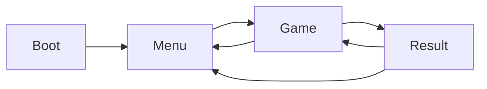

# Architecture

High-level map of Potato Horde as implemented (read against `src/`; Phases 0–11 complete, later systems may land while this doc is current).

## Stack

- **Phaser 4** + **TypeScript** + **Vite 6**
- Colored-box art (no sprite sheets required)
- Single-player; meta save via **localStorage** (`src/save/`)
- Path alias `@/` → `src/`

## Folder layout

```
src/
  main.ts              # Phaser.Game, scene list, window.__GAME__
  data/                # Tunables & registries (not hot-path logic)
    GameConfig.ts      # Arena size, player, combat baselines
    skills.ts          # Skill registry + balance sheet
    evolutions.ts      # Breakthrough / evolution defs
    enemies.ts         # Melee / ranged / blob types
    waves.ts           # Endless wave table
    allies.ts          # Ally slot config
    names.ts           # Display name lists
  scenes/
    BootScene.ts       # Title splash → Menu
    MenuScene.ts       # Start → Game
    GameScene.ts       # Run loop, input, systems wiring, __TEST__
    ResultScene.ts     # Death summary → retry / menu
  entities/
    Player.ts          # Move, HP, hurtbox, flags
    Enemy.ts           # Pooled enemy body
    Ally.ts            # Ally companion
    DummyTarget.ts     # Gate-4 practice dummy
  systems/             # Per-frame / pooled gameplay
    ArenaSystem.ts
    CombatSystem.ts    # Base gun + bullet pools + enemy bullets
    BulletPool.ts
    SkillSystem.ts     # Weapon behaviors from build
    EnemySystem.ts / EnemyPool.ts
    SpawnerSystem.ts   # Time waves / director
    HazardSystem.ts    # Blob puddles
    XpSystem.ts / OrbPool.ts
    RunBuild.ts        # Owned skills, stats, draft, rerolls
    BossSystem.ts
    AllySystem.ts
  ui/
    DraftUI.ts         # Level-up 3-card modal
    VirtualJoystick.ts
    DamageNumbers.ts
    FpsOverlay.ts
  save/
    SaveManager.ts / schema.ts
  utils/               # Pure helpers + EventBus + tests
```

Docs and agent workflow live under `docs/` and `.cursor/` (not runtime).

## Scene flow



| Scene key | Role |
|-----------|------|
| `Boot` | Brand flash, fade to Menu |
| `Menu` | Title + start (pointer / Enter / Space) |
| `Game` | Arena run — all combat systems |
| `Result` | Post-death stats; Retry → Game, Menu → Menu |

There is **no Hub scene yet** (planned Phase 16). Esc from Game returns to Menu.

## GameScene systems (runtime)

Created and updated from `GameScene`:

| System | Responsibility |
|--------|----------------|
| **ArenaSystem** | Large world bounds, grid visual |
| **Player** | WASD / joystick movement, HP, i-frames |
| **CombatSystem** | Starter auto-aim gun, player + enemy bullet pools |
| **SkillSystem** | Drafted weapons (dual pistol → drone, etc.) |
| **EnemySystem** | Melee / ranged / blob AI + pool |
| **SpawnerSystem** | Time-based spawn pressure / waves |
| **HazardSystem** | Ground puddles from blobs |
| **XpSystem** + **OrbPool** | Orbs, magnet, level queue, vacuum |
| **RunBuild** | Skill levels, stats, evolutions, draft offers |
| **BossSystem** | Brute / Spitter / Splitter |
| **AllySystem** | Recruit / follow allies (Phase 12+) |
| **DraftUI** | Modal over paused world |
| **DummyTarget** | Fixed practice target near center |

Pause and draft set `physics.world.isPaused` and call `setPaused` on systems so cooldowns and spawn timers freeze.

## Event bus

`src/utils/EventBus.ts` — global `eventBus` + `GameEvents`:

- Pause / Resume
- PlayerDeath / PlayerDamaged
- DraftOpen / DraftClose
- EnemyDeath / EnemyDamaged
- XpDrop / LevelUp
- BossIntro / BossIntroEnd
- HazardExpired

Subscribers **must** unsubscribe on scene shutdown (GameScene tracks `unsubs`).

## Data vs logic

- Balance and IDs live in **`src/data/*`** (skills, enemies, waves, evolutions).
- Behavior handlers live in **systems** (`SkillSystem` weapon behaviors, `BossSystem` phases).
- Pure math is preferred in **`src/utils/*`** with Vitest coverage.

## Persistence

- `SaveManager` / `schema` — versioned `SaveV1` in localStorage (hub/meta later).
- Debug-only: `__TEST__.saveBuild()` → `potato-horde-debug-build`.

## Dev instrumentation

| Hook | Where | Purpose |
|------|-------|---------|
| `window.__GAME__` | `main.ts` | Phaser game handle |
| `window.__TEST__` | `GameScene` create | Playtest / gate automation |
| `?debug=1` | query string | Hurtbox visibility |

See [PLAYTEST.md](PLAYTEST.md) for helper API details.
