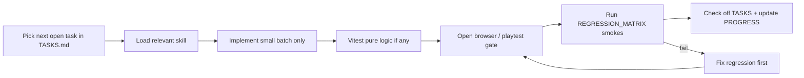

# Potato Horde — Master Build Plan

> Working title for the Zombie.io – Shooting RPG single-player clone.  
> **Source of truth for process:** this file + [TASKS.md](TASKS.md) + [PROGRESS.md](PROGRESS.md) + [REGRESSION_MATRIX.md](REGRESSION_MATRIX.md)  
> **Agent skills:** `.cursor/skills/*`  
> **Always-on rule:** `.cursor/rules/potato-horde-workflow.mdc`

---

## Autonomous workflow (how the agent must work)

1. **Never rush** — one micro-task or small approved batch per turn.
2. **Before coding** — read `PROGRESS.md` next task; load matching skill(s).
3. **After coding** — browser/playtest the stage gate; run regression smokes for touched systems.
4. **Update checklists** — mark `[x]` in `TASKS.md`, bump `PROGRESS.md`. Creating feature B must not leave feature A broken; if it does, mark A `regressed` and fix A before new work.
5. **Stop at gate** — do not start the next phase until the current Test Gate passes.

### Skills to use (auto)

| When | Skill |
|------|--------|
| Building systems / Phaser / combat loop | `survivors-game-dev` |
| Menus, HUD, draft UI, hub screens | `game-ui-hud` |
| Opening browser, gates, Playwright smoke | `browser-playtest` |
| Touching code that already works | `regression-safe-gamedev` |

---

## Game analysis (what we clone)

**Zombie.io – Shooting RPG** = top-down survivors-like / roguelite shooter:

| Pillar | Behavior |
|--------|----------|
| Control | Move only; weapons auto-aim / auto-fire |
| Run loop | Kill → EXP orbs → level up → pick 1 of 3 skills |
| Build | Weapons + stats + allies; Breakthrough evolves maxed skills |
| Threat | Hordes, blobs (puddles), ranged, bosses |
| Squad | Ally drop-ins that follow and fight |
| Meta | Hub: gear, heroes, currencies, permanent upgrades |
| Modes | Chapters + endless (no multiplayer/guilds in v1) |

**Avoid original pain:** silent skill failures, paywall soft-locks.  
**v1 art:** colored boxes only (data-driven entities so art swaps later).

---

## Tech stack (locked)

| Layer | Choice |
|-------|--------|
| Runtime | Browser (desktop first, touch later) |
| Engine | Phaser 4 |
| Language | TypeScript |
| Bundler | Vite |
| Physics | Arcade + pooled overlaps |
| Data | TS/JSON configs |
| Save | localStorage + export/import |
| Unit tests | Vitest (curves, damage, spawn math) |
| Browser tests | Cursor browser tools + later Playwright smoke |
| Deploy | Static host (no server) |

---

## Addiction hooks

Short runs, variable skill drafts, near-miss juice, Breakthrough spikes, meta drip every death, local daily challenge, capped pity buff, **no IAP walls**.

---

## Scope

**In:** endless scaling, chapters, drafts, weapons/stats/allies, breakthroughs, bosses, magnets, obstacles, gear/heroes meta, save, 200–500 enemies, edge QA.  
**Out v1:** multiplayer, guilds, gacha paywalls, ads, final art.

Repo: `e:\Project\Shooting game`

---

## Process rules

- Colored boxes: Player `#4ade80`, Melee `#ef4444`, Ranged `#f97316`, Boss `#a855f7`, Ally `#38bdf8`, Orb `#facc15`, Bullet `#e2e8f0`, Hazard `#dc2626`
- One batch → test gate → checklist update → stop
- Regression matrix mandatory after any change to shared systems (input, pause, pools, save, scenes)

---

## Micro-tasks T001–T560

Full checkbox list lives in **[TASKS.md](TASKS.md)** (living document). Summary:

| Phase | Range | Gate |
|-------|-------|------|
| 0 GDD | T001–T012 | Explain loop; docs exist |
| 1 Scaffold | T013–T028 | Menu↔Game, no console errors |
| 2 Arena | T029–T042 | Camera smooth |
| 3 Player | T043–T062 | WASD/touch, no diagonal speed cheat |
| 4 Combat | T063–T088 | Auto-fire kills dummy |
| 5 Enemies | T089–T118 | Chase, contact tick, blob/ranged |
| 6 Spawner | T119–T145 | 5 min endless stable |
| 7 XP Draft | T146–T175 | Level → 3 cards → resume |
| 8 Skills | T176–T210 | All skills visibly fire |
| 9 Breakthrough | T211–T225 | One evolution mid-run |
| 10 Survival | T226–T245 | Clean death + retry |
| 11 Bosses | T246–T270 | Brute clear |
| 12 Allies | T271–T295 | Drop + fight |
| 13 Map | T296–T315 | Kite pillars, no stuck |
| 14 Endless | T316–T335 | 15 min ≥50 FPS target |
| 15 Chapters | T336–T355 | Ch1 clear unlocks Ch2 |
| 16 Hub | T356–T380 | Earn/spend persists |
| 17 Gear | T381–T410 | Equip changes damage |
| 18 Heroes | T411–T435 | Passive passive works |
| 19 Juice/UI | T436–T460 | Tutorial run OK |
| 20 Harden | T461–T500 | P0 glitch backlog empty |
| 21 Retention | T501–T520 | Daily resets |
| 22 Final QA | T521–T560 | Ship checklist |

---

## Cadence

| Week | Phases | Playtest focus |
|------|--------|----------------|
| 1 | 0–4 | Move + shoot |
| 2 | 5–7 | First draft run |
| 3 | 8–11 | Skills, evolve, boss |
| 4 | 12–15 | Allies, map, modes |
| 5 | 16–18 | Meta |
| 6 | 19–22 | Polish + ship |

---

## First implementation (only after you say execute)

1. Scaffold Vite + Phaser 4 + TS  
2. Boot → Menu → Game + green player box  
3. Pass Gates 1–3 in browser  
4. Update TASKS/PROGRESS  
5. **Stop** and wait for OK before Phase 4
