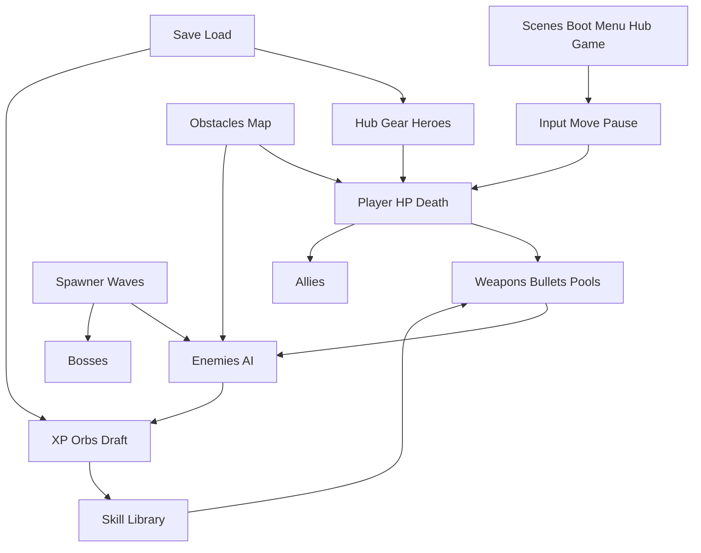

# Regression Matrix

**Purpose:** When you add or change a feature, re-verify systems that already passed so new work does not destroy old work.

## How to use

1. Find the **Touched area** you edited.
2. Run every **Must re-smoke** item (browser or unit).
3. If any fail → fix before marking the new task `done`.
4. Log failures in `docs/PROGRESS.md` and set status `regressed` on broken tasks in `TASKS.md` (uncheck them).

### How to run smokes

1. Ensure `npm run dev` is up (default **http://localhost:5173**). Prefer reusing an existing server — do not fight ports.
2. Open the game tab; DevTools console clear of unexpected errors.
3. For browser smokes: use keys from [CONTROLS.md](CONTROLS.md) or helpers in [PLAYTEST.md](PLAYTEST.md) (`window.__TEST__`, `window.__GAME__`).
4. For pure math / build helpers: `npm run test` (Vitest) — does not replace scene smokes.
5. Mark pass/fail by smoke **ID** (S01…) in your session notes.

## Dependency map

## Smoke catalog (keep short, run often)

| ID | Smoke | How to run (quick) | Pass criteria |
|----|-------|--------------------|---------------|
| S01 | Boot | Load `/` or `/ ?debug=1` | Page loads, canvas visible, no console errors |
| S02 | Scene nav | Start → Esc → Start again | Menu → Game → Menu (or Hub) without freeze |
| S03 | Move | WASD / arrows / joystick | Moves; diagonal not faster |
| S04 | Pause | Press **P**; try spawn/move | Pauses movement, spawner, cooldowns |
| S05 | Auto-fire | Stand near dummy or press **1** | Bullets fire and damage in range |
| S06 | Contact DPS | Touch a melee spawn | HP drains on interval, not every frame |
| S07 | Draft | Press **X** until level-up; pick **1** | 3 cards; pick resumes; skills apply |
| S08 | Death | `__TEST__.killPlayer()` or let HP hit 0 | Summary → retry; no ghost shooting |
| S09 | Save | Change saveable meta → refresh | Refresh keeps banknotes/unlocks/settings |
| S10 | Pool sanity | Play ~2 min or `__TEST__.spawnFiftyMelee()` | Entity counts stable (no leak spike) |
| S11 | Skill registry | `__TEST__.forceAllWeapons()` / `forceSkill(id)` | Each forced skill fires; none silent-fail |
| S12 | Resize | Drag window mid-run | UI still usable |

## Touched area → required smokes

| Touched area | Must re-smoke |
|--------------|---------------|
| Boot / Vite / index | S01 |
| Scene flow / transitions | S01 S02 |
| Input / movement / joystick | S03 S04 S07 |
| Pause / timeScale | S04 S05 S07 |
| Bullet pools / weapons | S05 S10 S11 |
| Enemy AI / contact | S05 S06 S10 |
| Spawner | S04 S06 S10 |
| XP / draft UI | S07 S04 S03 |
| Skill defs / evolutions | S07 S11 S05 |
| HP / death / i-frames | S06 S08 |
| Boss | S05 S08 S10 |
| Allies | S03 S05 S08 |
| Obstacles / map | S03 S05 S06 |
| Endless scaling | S10 S05 |
| Chapters unlock | S02 S09 |
| Hub / currencies | S02 S09 |
| Gear / heroes | S09 S05 |
| Save schema | S09 |
| HUD / settings | S01 S12 S09 |
| Performance / cull | S10 S01 |

## Anti-destruction rules

1. **Do not rewrite** a working system to “make room” for a new one — extend via data/config/hooks.
2. **Object pools:** never `new` in hot paths after pools exist; recycle.
3. **Scene restart:** destroy listeners; no duplicate event bus subscriptions.
4. **Save migrations:** never overwrite save without version bump + migrate.
5. **Feature flags:** if a skill is broken, disable with assert/log — never leave pickable but inert.
6. **UI layers:** draft/pause must block input to world; closing must restore exactly prior state.
7. **One source of truth** for player stats (base + meta + run + gear); no parallel hidden multipliers.

## After every batch (agent checklist)

- [ ] New task(s) checked in TASKS.md
- [ ] PROGRESS.md next-task updated
- [ ] Stage Test Gate run
- [ ] Regression smokes for touched areas run
- [ ] No new console errors
- [ ] If anything regressed: fixed or explicitly flagged before continuing
